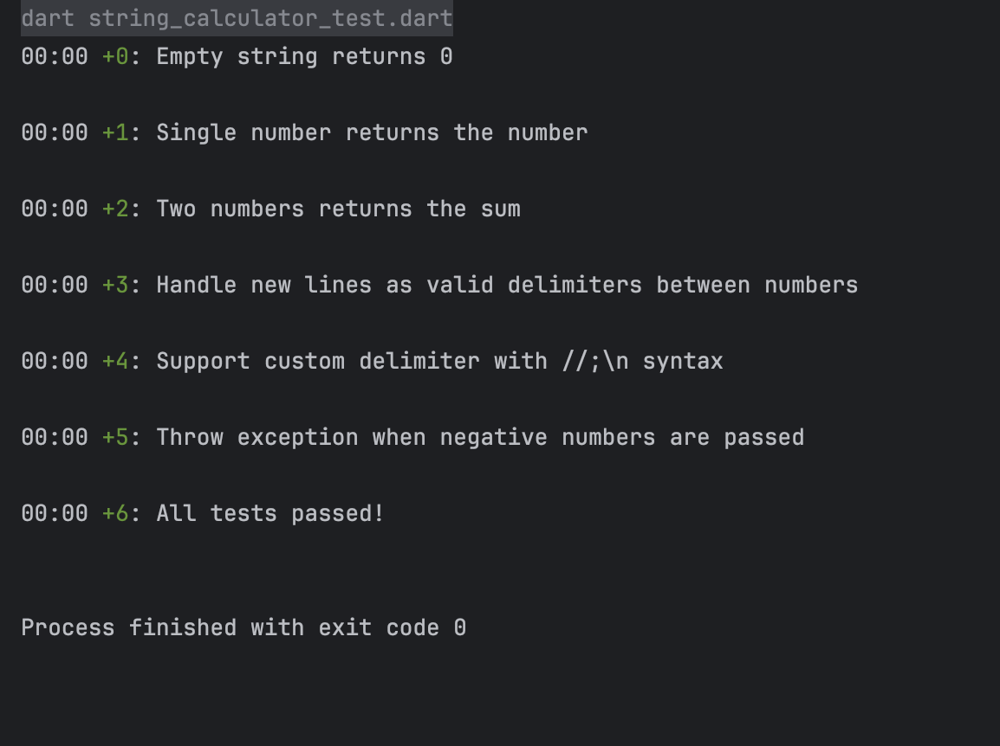

# String Calculator - Test Report

## Project Overview
This project implements a String Calculator in Dart, following TDD (Test-Driven Development) principles. The calculator parses a string of numbers separated by delimiters and returns their sum, supporting custom delimiters, multiple delimiters, delimiters of any length, and error handling for negative numbers.

## Test Cases
The following test cases were implemented and passed:

1. **Empty string returns 0**
2. **Single number returns the number**
3. **Two numbers returns the sum**
4. **Handle new lines as valid delimiters between numbers**
5. **Support custom delimiter with `//;\n` syntax**
6. **Throw exception when negative numbers are passed**
7. **Numbers bigger than 1000 should be ignored**
   - Example: `add('2,1001') == 2`
8. **Delimiters can be of any length with `//[delimiter]\n` format**
   - Example: `add('//[***]\n1***2***3') == 6`
   - Example: `add('//[abc]\n4abc5abc6') == 15`
9. **Allow multiple delimiters of any length with `//[delim1][delim2]\n` format**
   - Example: `add('//[*][%]\n1*2%3') == 6`
   - Example: `add('//[***][#][%]\n1***2#3%4') == 10`
   - Example: `add('//[**][%%]\n1**2%%3') == 6`
   - Example: `add('//[abc][def]\n4abc5def6') == 15`
10. **GetCalledCount returns the number of times add() was invoked**

## Test Results Screenshot

All tests passed successfully, as shown above. 
